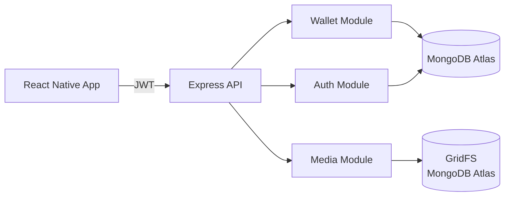
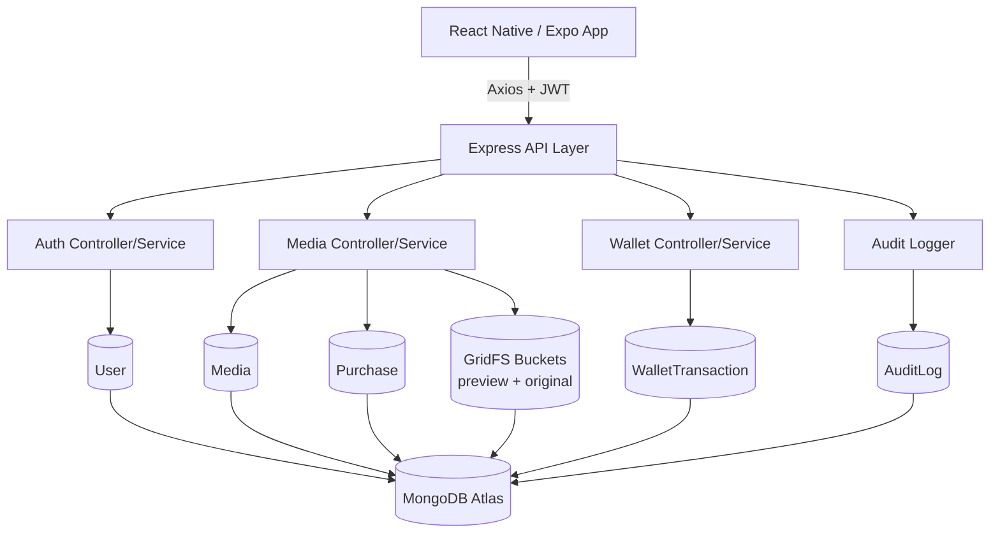
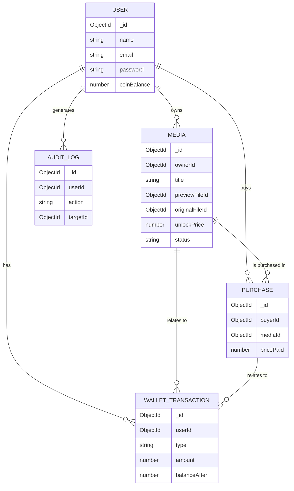
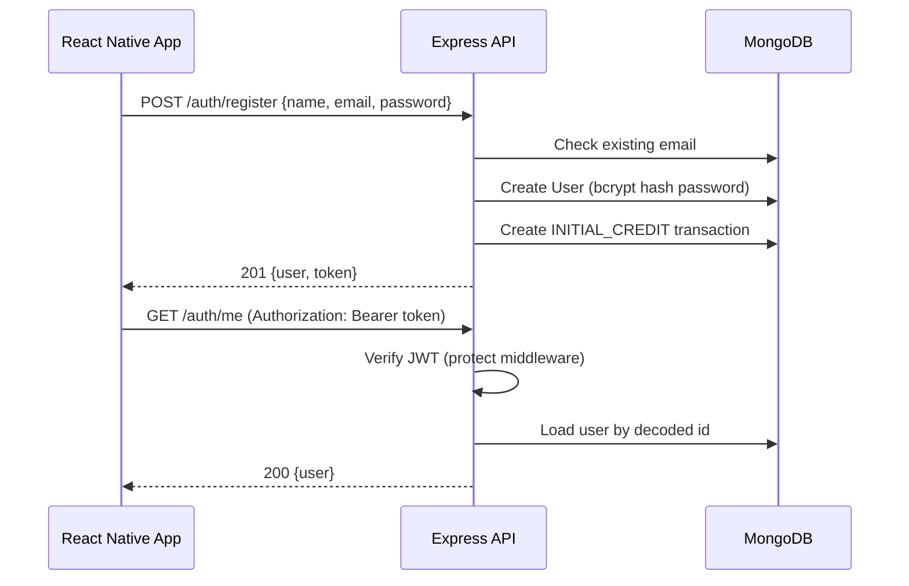
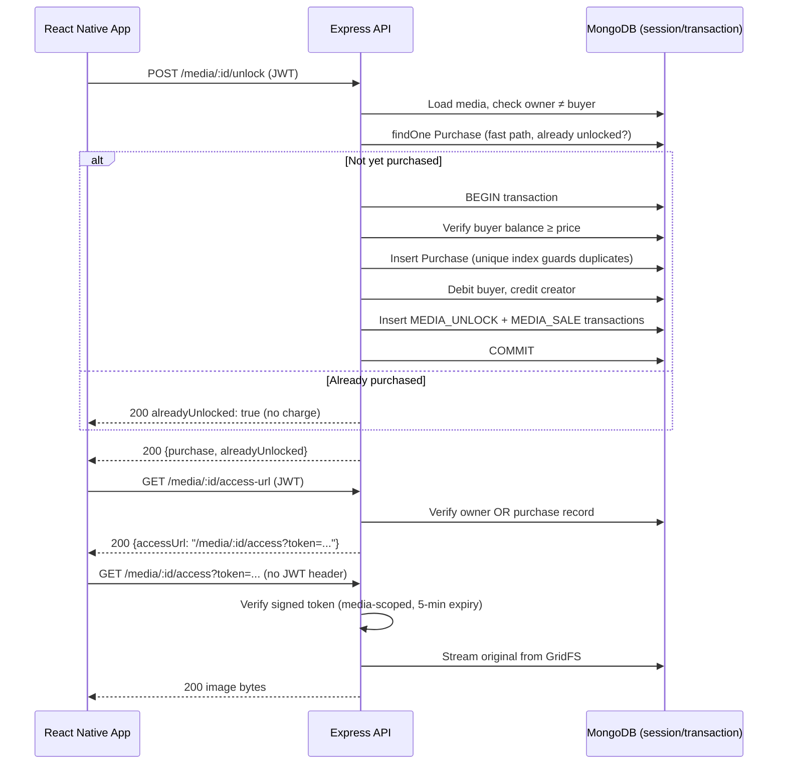

<div align="center">

#  Paid Media Locker

**Secure image monetization platform where creators publish paid content and users unlock media using an in-app wallet.**

[](https://nodejs.org)
[](https://expressjs.com)
[](https://www.mongodb.com/atlas)
[](https://expo.dev)
[](https://jwt.io)
[](https://www.docker.com)
[](https://jestjs.io)
[](#license)

</div>



> **Bonus features implemented:** Rate Limiting · Audit Logging · Temporary Signed Access URLs · Private Media Delivery (GridFS, no public URLs) · Duplicate Purchase Prevention (DB-level unique index) · Docker configuration · Jest/Supertest test suite

---

##  Overview

Paid Media Locker lets creators upload images, set a coin price, and monetize them without a payment processor. Buyers browse a feed of low-resolution **previews**, spend coins from an in-app **wallet** to unlock content, and only then gain access to the **original** image — delivered through a short-lived signed URL rather than a permanent public link.

**Who it's for:** creators who want a lightweight way to gate content behind a paywall, and buyers who want to preview before spending.

**Why previews exist:** letting anyone see the full-resolution original before payment defeats the purpose of "paid" content. A compressed, downsized preview (generated server-side with Sharp) gives buyers enough information to decide to purchase without giving away the asset itself.

**Why wallet-based unlocks:** the assignment scope excludes real payment providers. A server-authoritative coin ledger demonstrates the same integrity requirements (atomicity, no double-spend, no negative balances) without external payment infrastructure.

---

##  Features

###  Authentication
- Register / Login with JWT issuance
- `GET /auth/me` for the authenticated profile
- Passwords hashed with bcrypt, never returned in any response

###  Wallet
- New users start with a configurable coin balance (`DEFAULT_WALLET_BALANCE`)
- Server-side-only balance mutations — no client can set an arbitrary balance
- Full transaction ledger (`WalletTransaction`)

###  Media Upload
- `multipart/form-data` upload via Multer (memory storage)
- MIME-type validated (JPEG/PNG/WebP only), size-limited
- Sharp-generated compressed preview, stored separately from the original

###  Media Feed
- Paginated feed with `isOwner` / `isUnlocked` / `isLocked` computed server-side
- Frontend never decides access — it only renders what the API returns

###  Paid Unlock
- MongoDB session transaction: buyer debit + creator credit + purchase record + two ledger entries, atomically
- Price read only from the `Media` document, never from the client
- Idempotent from the client's perspective — a duplicate unlock call returns success without a second charge

###  Transaction History
- `GET /wallet/transactions`, paginated, scoped to the authenticated user
- Populates related media title for readability

###  Secure Media Access
- Preview and original are never exposed as permanent public URLs
- Original access requires a short-lived (5-minute), media-scoped signed token minted only after ownership/purchase verification

###  Security
- Helmet, restricted CORS, centralized error handler, ObjectId validation, no stack traces in production

###  Engineering Quality
- `express-rate-limit` (global + stricter auth limiter)
- Centralized audit logging (fire-and-forget, never blocks requests)
- Dockerfile + docker-compose (backend + MongoDB)
- Jest + Supertest suite using an in-memory MongoDB replica set

---

##  System Architecture



> **Note:** All media (previews and originals) is stored in MongoDB GridFS on the same Atlas cluster as the rest of the data — no third-party storage provider is used, keeping the deployment free-tier-compatible with no credit card requirement.

---

##  Folder Structure

Paid-Media-Locker/
│
├── backend/
│   ├── src/
│   │   ├── config/
│   │   │   ├── db.js
│   │   │   ├── env.js
│   │   │   └── gridfs.js
│   │   │
│   │   ├── controllers/
│   │   │   ├── auth.controller.js
│   │   │   ├── media.controller.js
│   │   │   ├── wallet.controller.js
│   │   │   └── library.controller.js
│   │   │
│   │   ├── middleware/
│   │   │   ├── auth.middleware.js
│   │   │   ├── error.middleware.js
│   │   │   ├── rateLimit.middleware.js
│   │   │   ├── upload.middleware.js
│   │   │   └── validate.middleware.js
│   │   │
│   │   ├── models/
│   │   │   ├── User.js
│   │   │   ├── Media.js
│   │   │   ├── Purchase.js
│   │   │   ├── WalletTransaction.js
│   │   │   └── AuditLog.js
│   │   │
│   │   ├── routes/
│   │   │   ├── auth.routes.js
│   │   │   ├── media.routes.js
│   │   │   ├── wallet.routes.js
│   │   │   └── library.routes.js
│   │   │
│   │   ├── services/
│   │   │   ├── auth.service.js
│   │   │   ├── media.service.js
│   │   │   ├── wallet.service.js
│   │   │   ├── image.service.js
│   │   │   ├── storage.service.js
│   │   │   └── signedUrl.service.js
│   │   │
│   │   ├── utils/
│   │   │   ├── AppError.js
│   │   │   ├── auditLogger.js
│   │   │   ├── catchAsync.js
│   │   │   ├── jwt.js
│   │   │   └── objectId.js
│   │   │
│   │   ├── validators/
│   │   │   ├── auth.validator.js
│   │   │   ├── media.validator.js
│   │   │   └── wallet.validator.js
│   │   │
│   │   ├── app.js
│   │   └── server.js
│   │
│   ├── tests/
│   ├── Dockerfile
│   ├── package.json
│   ├── .env.example
│   └── docker-compose.yml
│
├── frontend/
│   ├── assets/
│   │
│   ├── src/
│   │   ├── api/
│   │   │   └── client.js
│   │   │
│   │   ├── components/
│   │   │   ├── MediaCard.jsx
│   │   │   ├── Loading.jsx
│   │   │   └── Header.jsx
│   │   │
│   │   ├── config/
│   │   │   └── api.js
│   │   │
│   │   ├── context/
│   │   │   └── AuthContext.jsx
│   │   │
│   │   ├── navigation/
│   │   │   └── AppNavigator.jsx
│   │   │
│   │   ├── screens/
│   │   │   ├── LoginScreen.jsx
│   │   │   ├── RegisterScreen.jsx
│   │   │   ├── FeedScreen.jsx
│   │   │   ├── UploadScreen.jsx
│   │   │   ├── WalletScreen.jsx
│   │   │   ├── LibraryScreen.jsx
│   │   │   └── MediaDetailsScreen.jsx
│   │   │
│   │   └── utils/
│   │
│   ├── App.js
│   ├── app.json
│   ├── eas.json
│   ├── package.json
│   └── babel.config.js
│
├── .gitignore
├── LICENSE
└── README.md

**Why this separation matters:** routes only define endpoints, controllers only translate HTTP ↔ data, and all business logic (transactions, authorization checks, price calculation) lives in `services/`. This keeps controllers thin and testable, and means the unlock logic can be unit-tested independently of Express.

---

##  Backend Architecture

| Layer | Responsibility |
|---|---|
| **Routes** | Map HTTP verb + path to a controller, attach middleware (auth, validation, rate limiting) |
| **Controllers** | Parse request, call the relevant service, shape the HTTP response |
| **Services** | All business logic — auth, media creation, unlock transaction, wallet reads |
| **Models** | Mongoose schemas, indexes, instance methods (e.g. `comparePassword`, `toSafeObject`) |
| **Middleware** | `protect` (JWT verification), `validate` (Zod), `upload` (Multer), `errorHandler`, rate limiters |
| **Utils** | `AppError`, `catchAsync`, JWT signing/verification, `auditLogger`, ObjectId validation |
| **Config** | Environment loading with production fail-fast checks, DB connection, GridFS bucket accessor |

This keeps each concern in exactly one place — for example, changing how prices are validated only touches `validators/media.validator.js`, and swapping the storage backend only touches `services/storage/`, without any controller changes.

---

##  Database Design

| Model | Purpose | Key Fields | Relationships |
|---|---|---|---|
| **User** | Account + wallet balance | `email` (unique), `password` (hashed, `select:false`), `coinBalance` | Referenced by `Media.ownerId`, `Purchase.buyerId`, `WalletTransaction.userId` |
| **Media** | Uploaded paid content | `ownerId`, `previewFileId`, `originalFileId` (GridFS refs), `unlockPrice`, `status` | Belongs to one `User`; has many `Purchase` |
| **Purchase** | Unlock record | `buyerId`, `mediaId`, `pricePaid` | **Unique compound index** on `{buyerId, mediaId}` — the database-level guarantee against duplicate purchases |
| **WalletTransaction** | Append-only ledger | `userId`, `type` (`INITIAL_CREDIT`/`MEDIA_UNLOCK`/`MEDIA_SALE`), `amount`, `balanceAfter`, `relatedMediaId`, `relatedPurchaseId` | References `User`, optionally `Media`/`Purchase` |
| **AuditLog** | Security/event trail | `userId`, `action` (enum), `targetId`, `ipAddress`, `userAgent`, `metadata` | Loosely references `User`; never blocks request flow if the write fails |



---

##  Authentication Flow



Every protected route runs the same `protect` middleware: verify the JWT signature and expiry, load the user, attach it to `req.user`. Downstream code trusts `req.user` unconditionally — authorization decisions (ownership, purchase checks) happen in the controller/service layer using that trusted identity.

---

##  Media Unlock Flow



**Why the two-step access pattern:** React Native's `<Image>` component does not reliably attach custom `Authorization` headers on Android, so the original-media endpoint can't depend on the normal JWT header. Instead, an authenticated request (`/access-url`) — which *does* carry the JWT correctly via Axios — performs the real ownership/purchase check once, then mints a short-lived, media-scoped token embedded directly in the URL. The `<Image>` component can then load that URL with no special headers, while the token itself expires in 5 minutes and is rejected outright if used against any other media ID.

---

##  Security Decisions

| Decision | Why |
|---|---|
| **JWT authentication** | Stateless, scales without server-side session storage; standard for mobile clients |
| **bcrypt password hashing** | Passwords are never stored or logged in plaintext; hashing is one-way and salted |
| **`password: { select: false }`** | Prevents accidental leakage — a plain `User.find()` never returns the hash unless explicitly requested |
| **Ownership + purchase validation server-side** | The frontend is never trusted to decide access; `isOwner`/`isUnlocked` are computed on the server for every response |
| **Unique compound index on `{buyerId, mediaId}`** | Guarantees no duplicate purchase even under concurrent requests — enforced at the database level, not just an application-level check-then-insert |
| **MongoDB session transactions on unlock** | Purchase creation, buyer debit, creator credit, and both ledger entries succeed or roll back together — no partial state on failure |
| **Short-lived, media-scoped signed tokens** | Avoids exposing a permanent public URL for paid content, while working around React Native's `<Image>` header limitation |
| **GridFS instead of public object storage** | Original media is only reachable through an authenticated backend stream — never a static public link |
| **Rate limiting (global + stricter on auth)** | Mitigates brute-force login attempts and basic abuse without external infrastructure |
| **Audit logging** | Records `USER_LOGIN`, `MEDIA_UNLOCKED`, `FAILED_MEDIA_ACCESS`, etc. for after-the-fact investigation, without ever blocking the request it observes |
| **Zod validation on all inputs** | Rejects malformed registration, login, and upload payloads before they reach business logic |
| **Centralized error handler** | No raw Mongoose/JWT errors or stack traces ever reach the client in production |

>  **Honest limitation:** signed URLs reduce the risk of casual link-sharing (a leaked link expires in 5 minutes), but cannot prevent an *authorized* user from screenshotting or re-uploading content they've already legitimately unlocked. No delivery mechanism can fully solve that; it's a general limitation of any digital content platform.

---

##  API Documentation

### Auth

| Method | Endpoint | Auth | Body | Response |
|---|---|---|---|---|
| POST | `/api/v1/auth/register` | ❌ | `{name, email, password}` | `201 {user, token}` |
| POST | `/api/v1/auth/login` | ❌ | `{email, password}` | `200 {user, token}` |
| GET | `/api/v1/auth/me` | ✅ | — | `200 {user}` |

### Media

| Method | Endpoint | Auth | Body / Params | Response |
|---|---|---|---|---|
| POST | `/api/v1/media` | ✅ | multipart: `image, title, description, unlockPrice` | `201 {media}` |
| GET | `/api/v1/media` | ✅ | query: `page, limit` | `200 {items, total, page, totalPages}` |
| GET | `/api/v1/media/:id` | ✅ | — | `200 {media}` |
| GET | `/api/v1/media/:id/preview` | ❌* | — | image bytes |
| GET | `/api/v1/media/:id/access-url` | ✅ | — | `200 {accessUrl}` |
| GET | `/api/v1/media/:id/access` | ❌* | query: `token` | image bytes |
| POST | `/api/v1/media/:id/unlock` | ✅ | — | `200 {purchase, alreadyUnlocked}` |

\* No JWT header required by design — `/access` is protected instead by its short-lived signed token; `/preview` carries no purchase risk since it's a heavily compressed preview.

### Wallet

| Method | Endpoint | Auth | Response |
|---|---|---|---|
| GET | `/api/v1/wallet` | ✅ | `200 {coinBalance}` |
| GET | `/api/v1/wallet/transactions` | ✅ | `200 {transactions, total, page, totalPages}` |

### Library

| Method | Endpoint | Auth | Response |
|---|---|---|---|
| GET | `/api/v1/library` | ✅ | `200 {items, total, page, totalPages}` |

**Common error shape:**
```json
{ "success": false, "error": { "code": "FORBIDDEN", "message": "You have not unlocked this media" } }
```

| Status | Meaning |
|---|---|
| 400 | Validation error |
| 401 | Missing/invalid/expired token |
| 403 | Authenticated but not authorized |
| 404 | Resource not found |
| 409 | Duplicate (e.g. email already registered) |
| 429 | Rate limit exceeded |

---

##  Environment Variables

```env
NODE_ENV=development
PORT=5000

MONGODB_URI=your_mongodb_atlas_connection_string

JWT_SECRET=replace_with_a_long_random_string
JWT_EXPIRES_IN=7d

DEFAULT_WALLET_BALANCE=100

FRONTEND_ORIGIN=http://localhost:8081

MAX_FILE_SIZE=5242880

STORAGE_PROVIDER=s3rver

RATE_LIMIT_GLOBAL_WINDOW_MS=900000
RATE_LIMIT_GLOBAL_MAX=100
RATE_LIMIT_AUTH_WINDOW_MS=900000
RATE_LIMIT_AUTH_MAX=10
```

| Variable | Meaning |
|---|---|
| `MONGODB_URI` | Atlas connection string (free M0 tier works) |
| `JWT_SECRET` | Signing secret for both auth and media-access tokens |
| `JWT_EXPIRES_IN` | Login session token lifetime |
| `DEFAULT_WALLET_BALANCE` | Starting coin balance for new users |
| `FRONTEND_ORIGIN` | Allowed CORS origin |
| `MAX_FILE_SIZE` | Upload size limit in bytes |
| `STORAGE_PROVIDER` | `s3rver` for local dev, `gridfs` for deployed/demo |
| `RATE_LIMIT_*` | Window and max-request tuning for global vs. auth-specific limiters |

---

##  Running Locally

### Backend
```powershell
cd backend
npm install
Copy-Item .env.example .env
# fill in MONGODB_URI and JWT_SECRET
npm run dev
```

### Frontend
```powershell
cd frontend
npm install
# set API_BASE_URL in src/config/api.js to your LAN IP
npx expo start
```
Scan the QR code with **Expo Go** on an Android device on the same network.

### Docker (backend + MongoDB)
```powershell
docker compose up --build
docker exec -it <mongo-container-name> mongosh --eval "rs.initiate()"
```
> ℹ️ The one-time `rs.initiate()` step is required because the unlock flow uses MongoDB session transactions, which need a replica set — a plain single-node `mongo` container isn't one by default.

---

##  Deployment

| Step | Notes |
|---|---|
| **MongoDB Atlas** | Free M0 cluster; whitelist `0.0.0.0/0` for simplicity in this assignment |
| **Backend hosting** | Any Node-friendly host (e.g. Render, Railway) with `MONGODB_URI`/`JWT_SECRET` set as environment secrets |
| **Media storage in production** | `STORAGE_PROVIDER=gridfs` — media lives in the same Atlas cluster, avoiding reliance on the host's (often ephemeral) local disk |
| **Frontend** | Update `API_BASE_URL` in `src/config/api.js` to the deployed HTTPS URL before building |
| **APK** | Built via `eas build -p android --profile preview` (or equivalent) once `API_BASE_URL` points at the live backend |

---

##  Performance Considerations

- **Media delivery:** previews are compressed (Sharp, quality 40, max 600px width) specifically to keep feed loading fast; originals stream directly from GridFS through the backend.
- **Wallet integrity:** all balance changes happen inside a single MongoDB session transaction, so a crash mid-unlock can't leave a purchase without a matching ledger entry.
- **Duplicate prevention:** the unique index on `Purchase{buyerId, mediaId}` means MongoDB itself rejects concurrent duplicate purchases — no read-then-write race window.
- **Indexing:** `Media{status, createdAt}` supports the feed query; `WalletTransaction{userId, createdAt}` supports transaction history; `AuditLog{userId, createdAt}` and `{action, createdAt}` support future audit queries.
- **Scalability note:** GridFS is appropriate at this project's scale but isn't a substitute for a CDN-backed object store at high read volume — see Future Improvements.

---

##  Future Improvements

- Redis caching for the media feed
- Background job queue for preview generation (currently synchronous on upload)
- CDN-backed image delivery (migrate `StorageService` to S3/R2 behind the same interface)
- Video support
- Search/filtering on the feed
- Push notifications on unlock/sale
- CI/CD pipeline (GitHub Actions)
- Structured monitoring/alerting on top of the existing audit log

---

##  Demo Credentials

No pre-created demo account is required.

Reviewers can create a new account directly from the application using the registration screen. New users receive the default wallet balance configured by the backend.

---

##  License

This project is licensed under the MIT License. See the [LICENSE](LICENSE) file for details.
